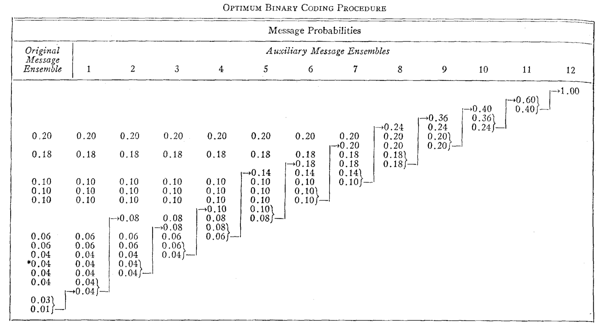

# HuffmanEncoder

### Category: Programming Abstractions
### Team Members: 
- Pablo Rodriguez Bertorello, Computer Science, Stanford University 

### Summary
Based on David Huffman's original Minimal-Redundancy Codes algorithm, one of the most cited papers in Computer Science:

### Paper
For details see the original publication http://compression.ru/download/articles/huff/huffman_1952_minimum-redundancy-codes.pdf

On Wikipedia: https://en.wikipedia.org/wiki/Huffman_coding